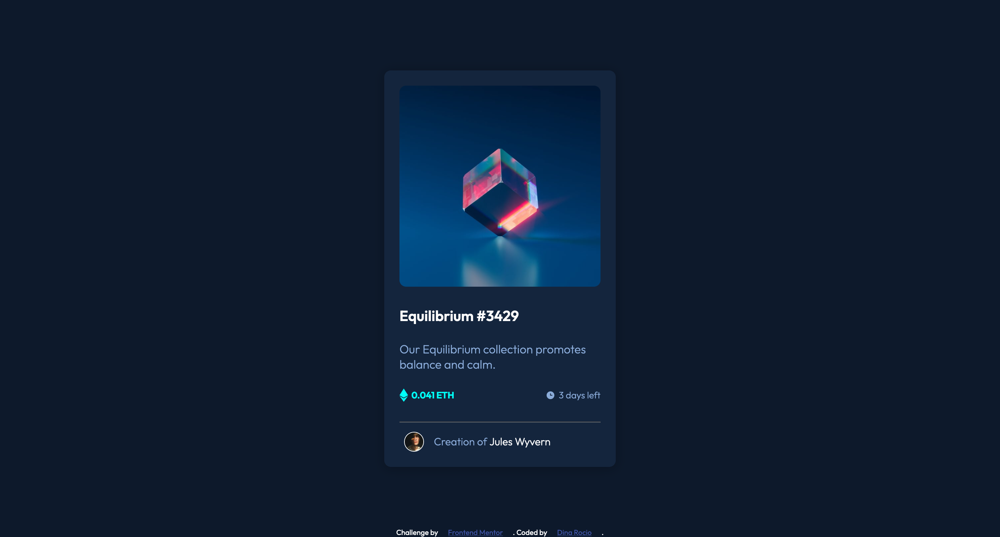

# Frontend Mentor - NFT preview card component solution

This is a solution to the [NFT preview card component challenge on Frontend Mentor](https://www.frontendmentor.io/challenges/nft-preview-card-component-SbdUL_w0U). Frontend Mentor challenges help you improve your coding skills by building realistic projects.

## Table of contents

- [Overview](#overview)
  - [The challenge](#the-challenge)
  - [Screenshot](#screenshot)
  - [Links](#links)
- [My process](#my-process)
  - [Built with](#built-with)
  - [What I learned](#what-i-learned)
  - [Useful resources](#useful-resources)
- [Author](#author)
- [Acknowledgments](#acknowledgments)

## Overview

### The challenge

Users should be able to:

- View the optimal layout depending on their device's screen size
- See hover states for interactive elements

### Screenshot



### Links

- Solution URL: [Add solution URL here](https://your-solution-url.com)
- Live Site URL: [Add live site URL here](https://your-live-site-url.com)

## My process

I started creating all the variables I will use, after that I create HTML content and finally I created styles and hovering styles..

### Built with

- Semantic HTML5 markup
- CSS custom properties
- Flexbox
- Desktop-first workflow
- Google fonts

### What I learned

I design a proper variables structure.
I learn that z-index won't work if position is not set in the container elements.
I lear how structure a proper READ.me

```css
:root {
  /* Colors */

  /* Primary */
  --clr-soft-blue: hsl(215, 51%, 70%);
  --clr-cyan: hsl(178, 100%, 50%);

  /* Neutral */
  --clr-very-dark-blue-mainBG: hsl(217, 54%, 11%);
  --clr-very-dark-blue-cardBG: hsl(216, 50%, 16%);
  --clr-very-dark-blue-line: hsl(215, 32%, 27%);
  --clr-white: hsl(0, 0%, 100%);

  /* Typography */

  /* font family */
  --ff-outfit: "Outfit", sans-serif;

  /* font weight */
  --fw-light: 300;
  --fw-regular: 400;
  --fw-semi-bold: 600;
}
```

### Useful resources

- [Z-index use](https://ishadeed.com/article/understanding-z-index/) - This helped me to undestand z-index use.

## Author

- Website - [Dina Rocio]
- Frontend Mentor - [@dinarocio](https://www.frontendmentor.io/profile/DinaRocio)
- Twitter - [@DinaRocio15](https://twitter.com/DinaRocio15)

## Acknowledgments

Front end mentor frienda that push me through.
